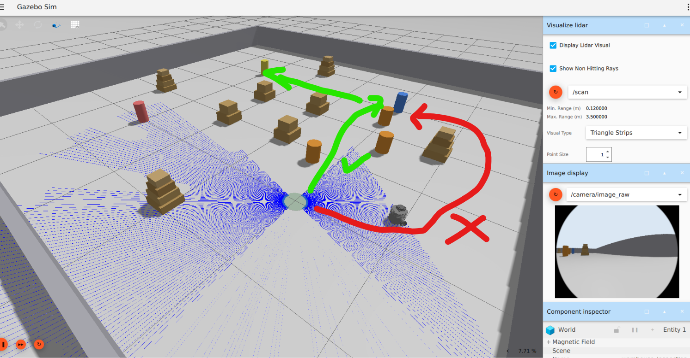
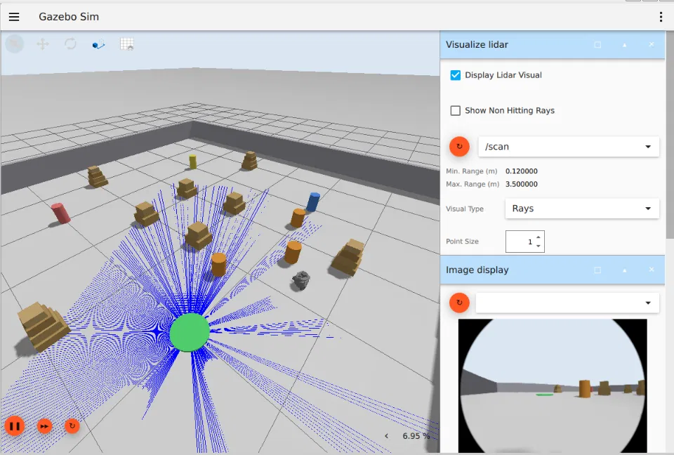

things to do:

1. robot movement speed needs to be more atleast make the movement little speed to do the things faster. its too much slow now. should also change the relevant areas safely. also make the simulation environment time 1.5x faster

2. the robot isnt carrying the lider with it. the lider is in the charging station. i want to fix that. i am using the burger camera robot.
, also the Lider is shown in the green thing (ig its charging station) but the robot should carry it with it to fix it. i guess its just a visual bug. since robot properly avoids the obstacles but still i want you to fix it in the proper way in the gui. (shown in )

3. it can actaully pass btwn the things/objects but it takes bigger path bcz it takes the more size then its needed as a margin. i want it to consider fit on its size and move instead of taking too much space / margin on it. fix it and update the code
 
the robot was solving obstacle avoidance more cautiously than its own size needs. The cause was in compute_escape_angle() — it looks for the smallest turn angle that clears a required_clearance distance. The robot only actually needs about 0.23m of clearance (its own half-width)

4. a new PLANNING state (6 states total now, still ≥5 required). On s, mission_controller builds the checkpoint route as a nav_msgs/Path (current pose → each waypoint) and publishes it once on /planned_path, then auto-advances to NAVIGATE — logged as IDLE → PLANNING → NAVIGATE, exactly the "plan first, then move automatically" flow you wanted. AVOID_OBSTACLE/REPLAN are untouched — the plan is the checkpoint order, live obstacles are still handled reactively as before. gui need a toggle which shows the path that is planned on enabled. and can also disable the path that is being shown, but plan shouldnt change. robot first plans the path and then i want you to draw a line on the planned path and then move towards the checkpoints. it can just first plan then move automatically? also tell me if it go against my guidelines in the brief?
IF NOT THEN IMPLEMENT THIS. WHERE I WANT TO MAKE IT FOLLOW THAT PLANNED OPTIMAL PATH INSTEAD OF HALLUCINATING AND RANDOMLY MOVING

Robot is randomly moving in the warehouse environment. its just moving like stupid.

currently its just doing this: (it just sees the obstacle from faraway. i want it not to quickly decide - do the planning properly if brief allows me to do it.)
avoidance.
[mission_controller-7] [INFO] [1789761183.005805438] [mission_controller]: State transition: NAVIGATE -> AVOID_OBSTACLE
[monitor_node-8] [INFO] [1789761183.007258091] [monitor_node]: [STATE CHANGE] NAVIGATE -> AVOID_OBSTACLE
[monitor_node-8] [INFO] [1789761183.007692446] [monitor_node]: Obstacle detected -> switching to AvoidObstacle
[mission_controller-7] [INFO] [1789761197.552634446] [mission_controller]: State transition: AVOID_OBSTACLE -> REPLAN
[monitor_node-8] [INFO] [1789761197.554306964] [monitor_node]: [STATE CHANGE] AVOID_OBSTACLE -> REPLAN
[mission_controller-7] [INFO] [1789761224.073714090] [mission_controller]: State transition: REPLAN -> NAVIGATE
[monitor_node-8] [INFO] [1789761224.074767380] [monitor_node]: [STATE CHANGE] REPLAN -> NAVIGATE
[mission_controller-7] [WARN] [1789761229.969803788] [mission_controller]: STALL DETECTED (odometry): commanded forward motion for 1.4s but moved only 0.025m. Treating as a blocked/pushed obstacle regardless of LIDAR state and triggering avoidance.
[mission_controller-7] [INFO] [1789761229.970848975] [mission_controller]: State transition: NAVIGATE -> AVOID_OBSTACLE
[monitor_node-8] [INFO] [1789761229.971934359] [monitor_node]: [STATE CHANGE] NAVIGATE -> AVOID_OBSTACLE
[monitor_node-8] [INFO] [1789761229.982486029] [monitor_node]: Obstacle detected -> switching to AvoidObstacle

_________________
i am using gazebo 8.11, dont run anything in the sandbox. u can test if you want for the did changes but dont overspend time/tool and token on it.
change the code files that needs to be edited and then present the changed files. do the proper analysis and fix all the things mentioned